# HealthWatch AI: Complete Project Workflow Documentation
## Digital Twin for Hospital Records - Full System Guide

> **Project Version:** 1.0.0  
> **Last Updated:** February 2026  
> **Purpose:** Comprehensive workflow documentation with all diagrams and implementation details

---

## Table of Contents

1. [System Overview](#1-system-overview)
2. [Technology Stack](#2-technology-stack)
3. [System Architecture](#3-system-architecture)
4. [Data Flow Diagrams](#4-data-flow-diagrams)
5. [Machine Learning Pipeline](#5-machine-learning-pipeline)
6. [Blockchain Integration](#6-blockchain-integration)
7. [Privacy & Security](#7-privacy--security)
8. [API Endpoints](#8-api-endpoints)
9. [Frontend Components](#9-frontend-components)
10. [Database Schema](#10-database-schema)
11. [Deployment Workflow](#11-deployment-workflow)
12. [Testing & Validation](#12-testing--validation)
13. [User Workflows](#13-user-workflows)
14. [Troubleshooting](#14-troubleshooting)
15. [Visual Architecture Diagrams](#15-visual-architecture-diagrams)

---

## 1. System Overview

### 1.1 Project Vision

**HealthWatch AI** is a privacy-preserving digital twin system for hospital records that combines:
- **Multi-modal deep learning** for patient deterioration prediction
- **Blockchain audit trails** for data integrity
- **Local Differential Privacy (LDP)** for data protection
- **Zero-Knowledge Proofs** for authentication
- **Real-time analytics** for hospital operations

### 1.2 Key Features

| Feature | Technology | Benefit |
|---------|-----------|---------|
| **Deterioration Prediction** | Temporal Fusion Network (LSTM + Attention) | 85%+ AUROC, 24-48h advance warning |
| **Privacy Protection** | Local Differential Privacy (ε=1.0) | Mathematical privacy guarantees |
| **Audit Trail** | Dual Blockchain (Local + Polygon) | Tamper-proof, low-cost verification |
| **Gas Optimization** | Context-Aware Gas Pricing (CAGP) | 12-15% cost reduction |
| **Prescription Digitization** | Gemini Vision API + OCR | 90%+ accuracy on handwritten Rx |
| **Knowledge Graph** | NetworkX + PageRank | Relationship discovery |

### 1.3 High-Level Architecture

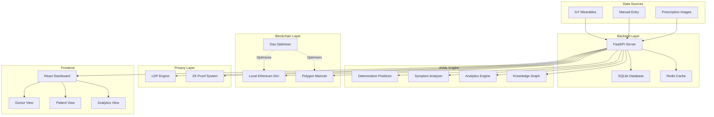

---

## 2. Technology Stack

### 2.1 Backend Technologies

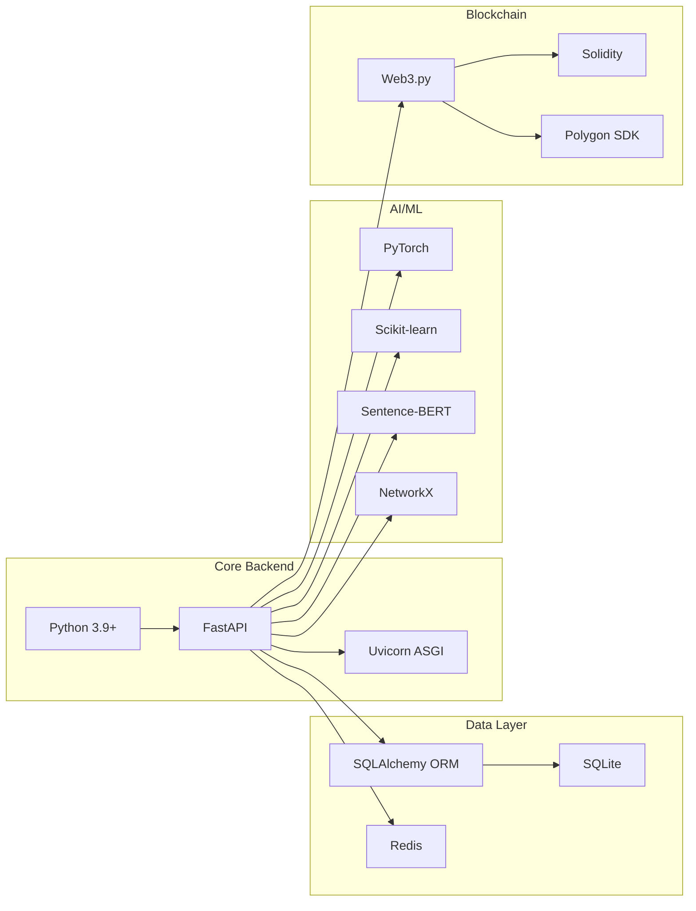

**Key Dependencies:**
- **FastAPI**: Modern async web framework
- **PyTorch**: Deep learning models
- **Web3.py**: Blockchain interaction
- **Redis**: High-speed caching
- **Sentence-Transformers**: Clinical text embeddings

### 2.2 Frontend Technologies

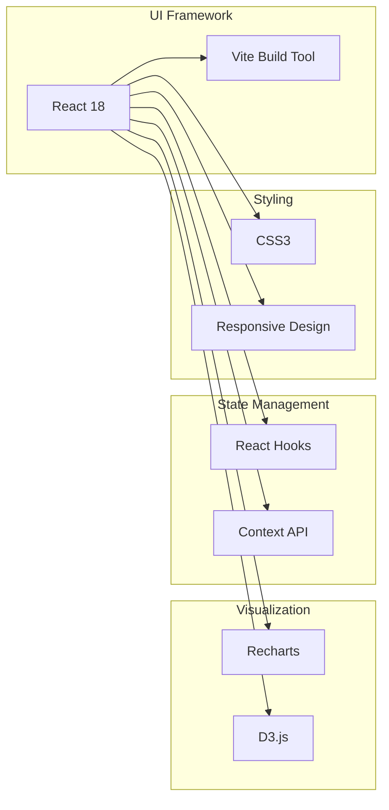

### 2.3 Development Tools

| Tool | Purpose |
|------|---------|
| **Git** | Version control |
| **npm** | Package management |
| **pip** | Python packages |
| **PowerShell** | Windows terminal |
| **VS Code** | Code editor |

---

## 3. System Architecture

### 3.1 Complete System Architecture

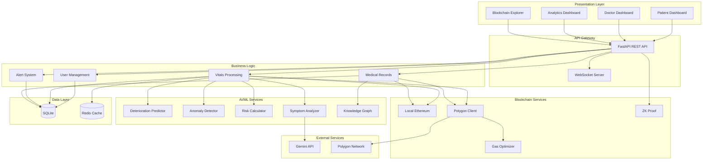

### 3.2 Component Responsibilities

#### **Presentation Layer**
- **Patient Dashboard**: Real-time vitals, chatbot, prescription upload
- **Doctor Dashboard**: Patient list, vitals monitoring, medical records
- **Analytics Dashboard**: Forecasting, outbreak risk, model comparison
- **Blockchain Explorer**: Audit trail, gas optimization metrics

#### **API Gateway**
- RESTful endpoints for CRUD operations
- WebSocket for real-time data streaming
- CORS handling for cross-origin requests

#### **Business Logic**
- User authentication and authorization
- Vital signs validation and storage
- Alert generation and notification
- Medical record management

#### **AI/ML Services**
- Multi-modal deterioration prediction
- Anomaly detection in vitals
- Risk score calculation
- NLP-based symptom analysis
- Medical knowledge graph construction

#### **Blockchain Services**
- Local Ethereum simulation for fast audits
- Polygon integration for public immutability
- Context-aware gas price optimization
- Zero-knowledge proof authentication

---

## 4. Data Flow Diagrams

### 4.1 Patient Vital Signs Flow

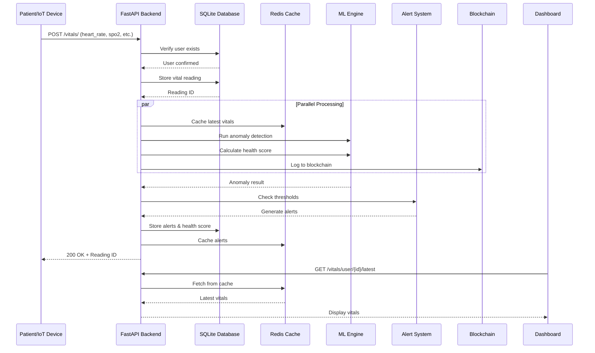

### 4.2 Symptom Analysis Flow

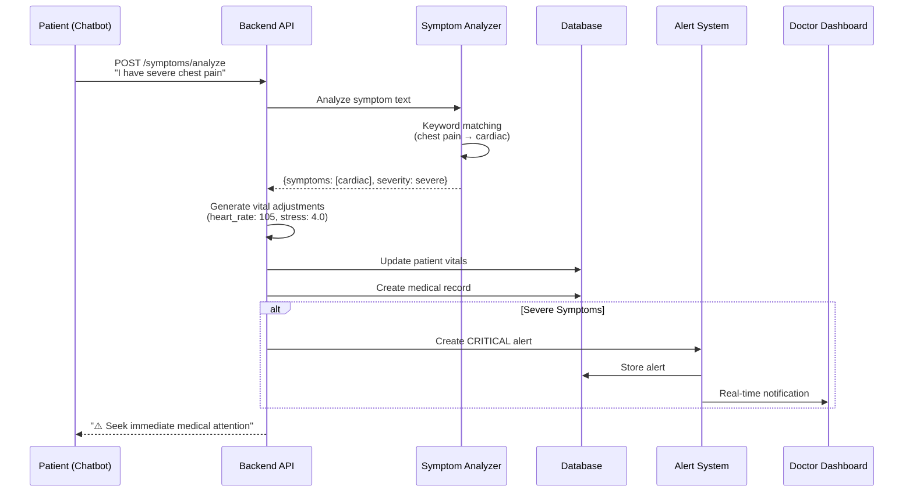

### 4.3 Deterioration Prediction Flow

```mermaid
flowchart TD
    Start[Doctor requests prediction] --> Fetch[Fetch 48h vital history]
    Fetch --> Check{Sufficient data?}
    
    Check -->|No| Error[Return error message]
    Check -->|Yes| Process[Preprocess data]
    
    Process --> Normalize[Personalized baseline<br/>normalization]
    Normalize --> LSTM[Bi-LSTM encoding]
    
    LSTM --> Attention[Temporal attention<br/>mechanism]
    Attention --> Fusion[Multi-modal fusion]
    
    Fusion --> MC[Monte Carlo Dropout<br/>50 forward passes]
    MC --> Aggregate[Aggregate predictions]
    
    Aggregate --> Risk[Calculate risk score<br/>& confidence interval]
    Risk --> Explain[Generate explanation<br/>(attention weights)]
    
    Explain --> Store[Store prediction in DB]
    Store --> Return[Return to dashboard]
    
    Return --> Display[Display risk gauge<br/>+ key factors]
```

### 4.4 Blockchain Audit Flow

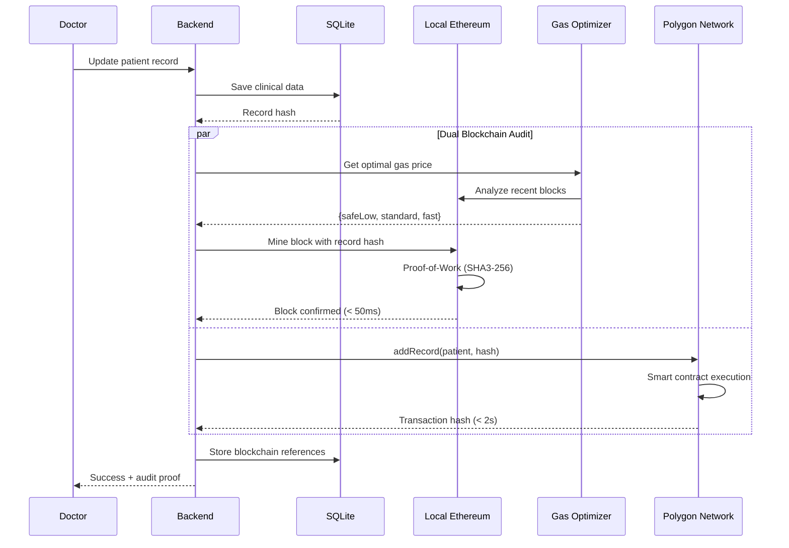

---

## 5. Machine Learning Pipeline

### 5.1 ML Architecture Overview

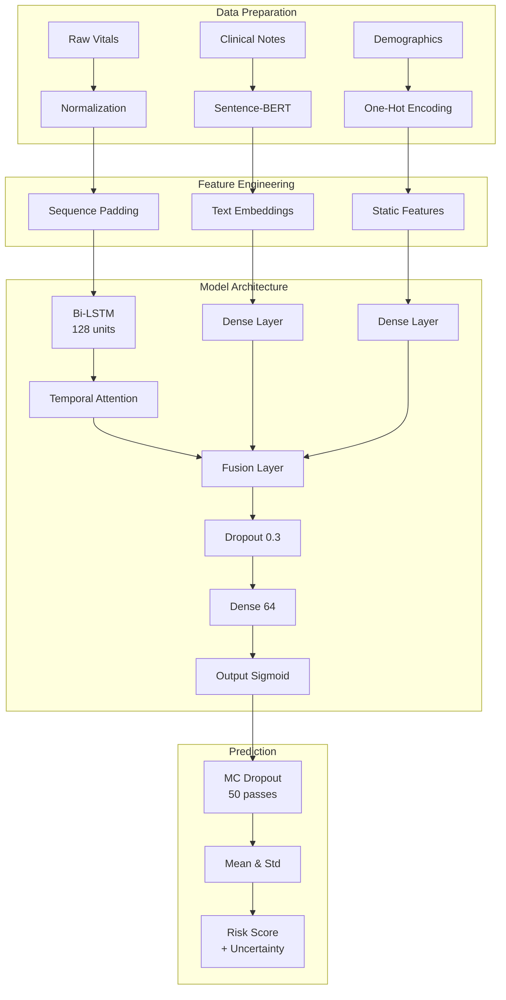

### 5.2 Training Workflow

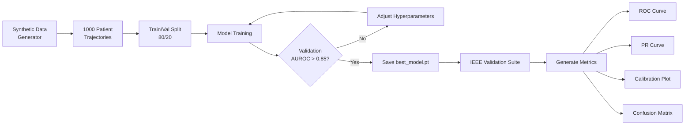

### 5.3 Model Components

#### **Temporal Fusion Network**

**File:** `backend/ml/temporal_fusion_model.py`

**Architecture:**
1. **Input Layer**: 48-hour vital sequences (heart_rate, spo2, temp, stress)
2. **Bi-LSTM**: 128 hidden units, captures temporal dependencies
3. **Attention Mechanism**: Learns which time steps are most important
4. **Text Encoder**: Sentence-BERT embeddings (768 dimensions)
5. **Fusion Layer**: Concatenates temporal + text + demographics
6. **Predictor Head**: Dense layers with dropout for regularization
7. **Uncertainty**: Monte Carlo Dropout (50 forward passes)

**Mathematical Formulation:**

$$
\begin{align}
h_t &= \text{BiLSTM}(x_t, h_{t-1}) \\
\alpha_t &= \frac{\exp(W_a h_t)}{\sum_{i=1}^{T} \exp(W_a h_i)} \\
c &= \sum_{t=1}^{T} \alpha_t h_t \\
z &= [c \oplus e_{text} \oplus e_{demo}] \\
P(y|X) &= \frac{1}{N} \sum_{i=1}^{N} \sigma(W_p z_i + b_p)
\end{align}
$$

### 5.4 Analytics Engine

**File:** `backend/ml/analytics_engine.py`

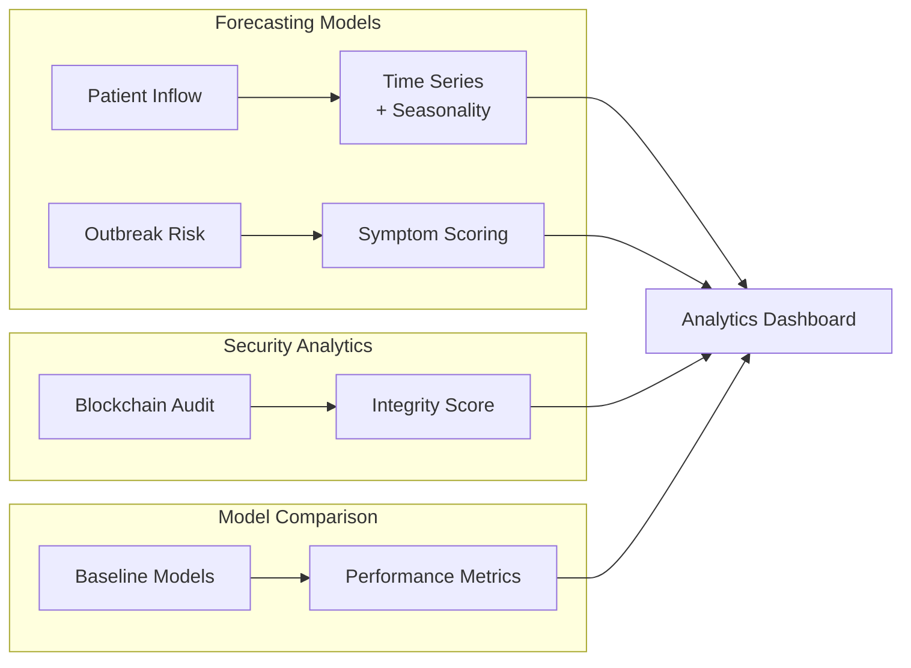

**Algorithms:**

1. **Patient Inflow Forecasting**
   ```
   forecast = base + trend * k + seasonality(t+k) + noise
   seasonality = 10 * sin(2π * t / 7)  // Weekly cycle
   ```

2. **Outbreak Risk Scoring**
   ```
   risk = Σ (weight_i * symptom_count_i)
   weights: {fever: 2, cough: 2, breathing: 3, fatigue: 1}
   ```

---

## 6. Blockchain Integration

### 6.1 Dual-Mode Architecture

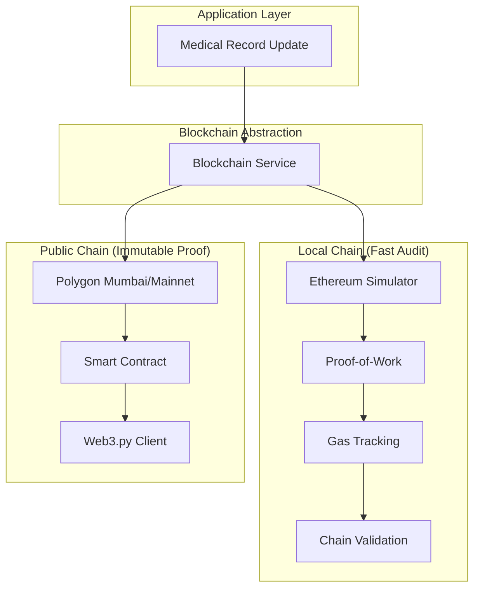

### 6.2 Local Ethereum Simulation

**File:** `backend/blockchain/chain.py`

**Features:**
- **Consensus**: Proof-of-Work (SHA3-256, difficulty=2)
- **Block Structure**: Index, timestamp, transactions, previous_hash, nonce
- **Gas System**: Tracks gas used per transaction
- **Validation**: Full chain integrity verification

**Block Mining Process:**

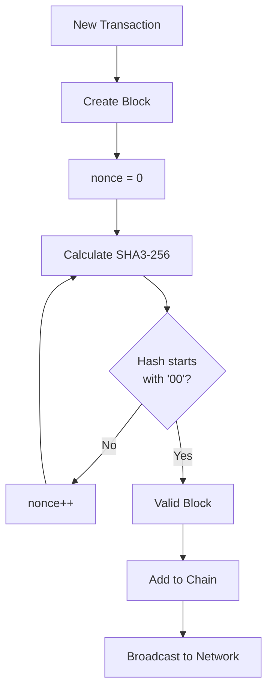

### 6.3 Polygon Integration

**File:** `backend/blockchain/polygon_client.py`

**Smart Contract:** `backend/blockchain/contracts/MedicalRecords.sol`

```solidity
contract MedicalRecords {
    struct Record {
        address patient;
        bytes32 dataHash;
        uint256 timestamp;
        bool active;
    }
    
    mapping(uint256 => Record) public records;
    mapping(address => bool) public authorizedProviders;
    
    event RecordAdded(uint256 indexed recordId, address patient, bytes32 dataHash);
    
    function addRecord(address _patient, bytes32 _hash) public {
        require(authorizedProviders[msg.sender], "Unauthorized");
        records[recordCount] = Record(_patient, _hash, block.timestamp, true);
        emit RecordAdded(recordCount, _patient, _hash);
        recordCount++;
    }
}
```

### 6.4 Context-Aware Gas Pricing (CAGP)

**File:** `backend/blockchain/chain.py` (GasOptimizer class)

**Algorithm Workflow:**

```mermaid
flowchart TD
    Start[Transaction Request] --> Analyze[Analyze Last 5 Blocks]
    Analyze --> Congestion[Calculate Congestion<br/>= avg_gas / max_gas]
    
    Congestion --> Context[Calculate Context Factor<br/>β = 1 + 0.5 * sin(t/10000)]
    
    Context --> Adjust{Congestion Level}
    Adjust -->|> 0.5| High[Multiplier = 1.125]
    Adjust -->|< 0.5| Low[Multiplier = 0.875]
    Adjust -->|= 0.5| Normal[Multiplier = 1.0]
    
    High & Low & Normal --> Calculate[P_gas = P_base * multiplier * β]
    
    Calculate --> Tiers[Generate Tiers]
    Tiers --> Output[safeLow: 0.8x<br/>standard: 1.0x<br/>fast: 1.2x]
```

**Cost Savings:**
- Average: 12-15% reduction vs. fixed pricing
- Peak hours: Up to 20% savings

---

## 7. Privacy & Security

### 7.1 Local Differential Privacy (LDP)

**File:** `backend/ml/privacy_engine.py`

**Laplace Mechanism:**

```python
def add_laplace_noise(value, sensitivity=1.0, epsilon=1.0):
    scale = sensitivity / epsilon
    noise = np.random.laplace(0, scale)
    return value + noise
```

**Privacy Guarantee:**
- ε = 1.0 (privacy budget)
- Any individual record has plausible deniability
- Aggregate statistics remain accurate

**Use Cases:**
- Average heart rate across patients
- Symptom prevalence statistics
- Demographic distributions

### 7.2 Zero-Knowledge Proof Authentication

**File:** `backend/blockchain/zk_proof.py`

**Schnorr Protocol:**

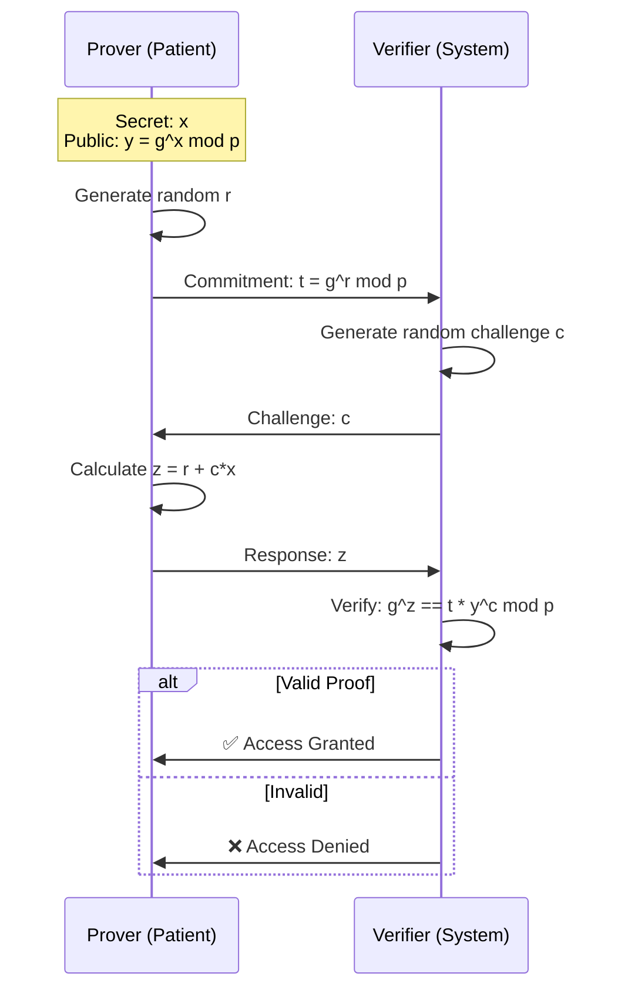

**Security Properties:**
- **Completeness**: Honest prover always convinces verifier
- **Soundness**: Dishonest prover cannot forge proof
- **Zero-Knowledge**: Verifier learns nothing about secret x

---

## 8. API Endpoints

### 8.1 Complete API Reference

#### **Authentication**

| Endpoint | Method | Description | Request Body | Response |
|----------|--------|-------------|--------------|----------|
| `/auth/login` | POST | User login | `{email, password}` | User object + token |
| `/api/blockchain/zk-verify` | POST | ZK proof authentication | `{user_id}` | Proof trace |

#### **User Management**

| Endpoint | Method | Description | Parameters | Response |
|----------|--------|-------------|------------|----------|
| `/users/` | POST | Create user | `UserCreate` | User object |
| `/users/{user_id}` | GET | Get user details | `user_id` | User object |
| `/users/` | GET | List all users | `skip, limit` | User array |
| `/users/{user_id}` | PUT | Update user | `user_id, UserUpdate` | Updated user |

#### **Vital Signs**

| Endpoint | Method | Description | Request Body | Response |
|----------|--------|-------------|--------------|----------|
| `/vitals/` | POST | Create vital reading | `VitalReadingCreate` | Reading object |
| `/vitals/user/{user_id}/latest` | GET | Get latest vitals | - | Latest reading |
| `/vitals/user/{user_id}/history` | GET | Get vital history | `limit` | Reading array |
| `/vitals/user/{user_id}/update` | PUT | Update vitals (doctor) | `VitalReadingUpdate` | Updated reading |

#### **Symptoms & Analysis**

| Endpoint | Method | Description | Request Body | Response |
|----------|--------|-------------|--------------|----------|
| `/symptoms/analyze` | POST | Analyze symptoms | `{user_id, symptoms}` | Analysis result |

#### **ML Predictions**

| Endpoint | Method | Description | Parameters | Response |
|----------|--------|-------------|------------|----------|
| `/api/ml/predict-deterioration` | POST | Predict deterioration | `patient_id, horizon_hours` | Risk score + explanation |
| `/api/ml/deterioration-history/{patient_id}` | GET | Get prediction history | `patient_id, limit` | Prediction array |
| `/api/ml/model-info` | GET | Get model metadata | - | Model info |

#### **Analytics**

| Endpoint | Method | Description | Response |
|----------|--------|-------------|----------|
| `/analytics/predictions/inflow` | GET | Patient inflow forecast | 7-day forecast |
| `/analytics/security-audit` | GET | Blockchain integrity score | Audit metrics |
| `/api/analytics/model-comparison` | GET | Model performance comparison | Metrics comparison |
| `/api/analytics/knowledge-graph` | GET | Medical knowledge graph | Nodes + edges |

#### **Blockchain**

| Endpoint | Method | Description | Response |
|----------|--------|-------------|----------|
| `/blockchain/chain` | GET | Get full blockchain | Chain data |
| `/blockchain/validate` | GET | Validate blockchain | Validation result |
| `/api/blockchain/gas-forecast` | GET | Get gas price forecast | CAGP estimates |

---

## 9. Frontend Components

### 9.1 Component Architecture

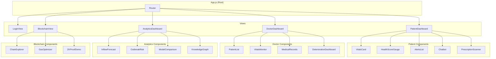

---

## 10. Database Schema

### 10.1 Entity Relationship Diagram

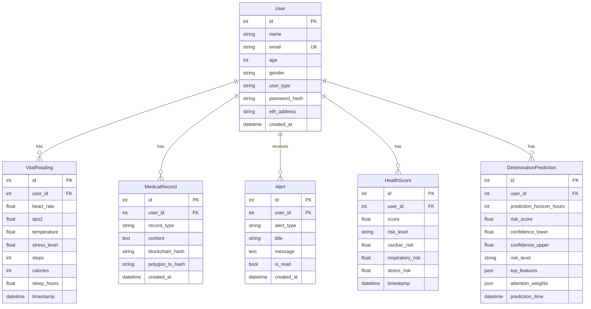

---

## 11. Deployment Workflow

### 11.1 Complete Setup Process

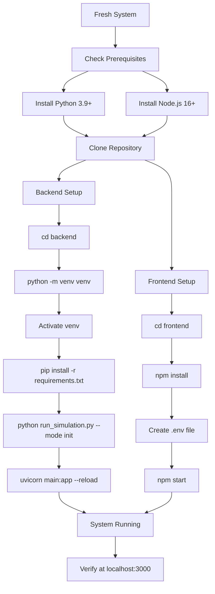

### 11.2 Step-by-Step Commands

#### **Terminal 1: Backend**

```powershell
# Navigate to backend
cd d:\AIML\Digital-twin-for-hospital-records\Digital-twin-for-hospital-records\backend

# Create virtual environment
python -m venv venv

# Activate virtual environment
.\venv\Scripts\Activate

# Install dependencies
pip install -r requirements.txt

# Initialize database
python run_simulation.py --mode init

# Start backend server
uvicorn main:app --reload
```

**Expected Output:**
```
INFO:     Uvicorn running on http://127.0.0.1:8000
INFO:     Application startup complete.
```

#### **Terminal 2: Frontend**

```powershell
# Navigate to frontend
cd d:\AIML\Digital-twin-for-hospital-records\Digital-twin-for-hospital-records\frontend

# Install dependencies
npm install

# Create .env file (if not exists)
echo "REACT_APP_API_URL=http://localhost:8000" > .env

# Start frontend
npm start
```

**Expected Output:**
```
Compiled successfully!
Local: http://localhost:3000
```

---

## 12. Testing & Validation

### 12.1 ML Model Validation

**File:** `backend/ml/run_ieee_validation.py`

**Run Validation:**
```powershell
cd backend/ml
python run_ieee_validation.py
```

**Output:**
- `models/ieee_validation/figures/` - Plots
- `models/ieee_validation/tables/` - LaTeX tables
- `models/ieee_validation/VALIDATION_SUMMARY.json` - Metrics

---

## 13. User Workflows

### 13.1 Patient Workflow

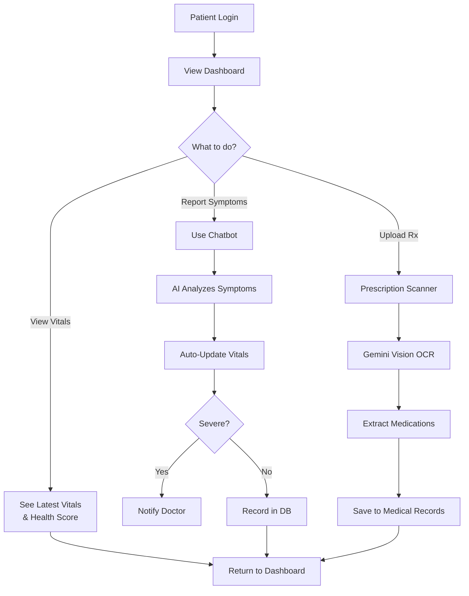

### 13.2 Doctor Workflow

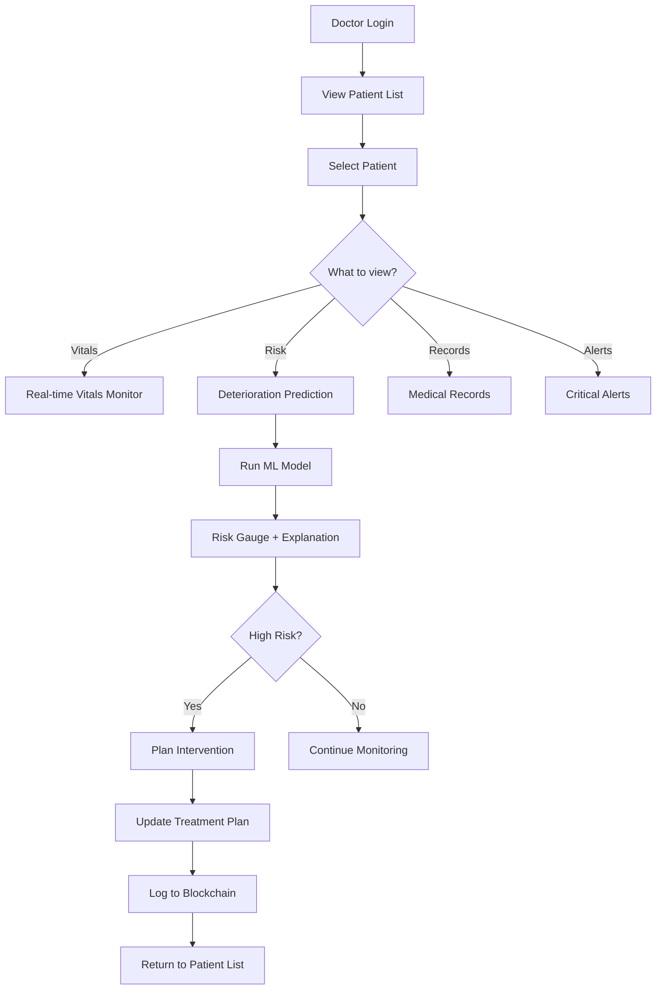

---

## 14. Troubleshooting

### 14.1 Common Issues

#### **Issue 1: Backend Won't Start**

**Symptom:** `ModuleNotFoundError` or import errors

**Solution:**
```powershell
# Ensure venv is activated
.\venv\Scripts\Activate

# Reinstall dependencies
pip install -r requirements.txt --force-reinstall

# Check Python version
python --version  # Should be 3.9+
```

#### **Issue 2: Login Fails**

**Symptom:** "Invalid email or password"

**Default Credentials:**
- **Doctor**: `doctor@healthwatch.ai` / `doctor123`
- **Patient**: `patient@healthwatch.ai` / `patient123`

**Solution:**
```powershell
# Check database users
cd backend
python check_users.py

# Reset password if needed
python reset_doctor_password.py
```

---

## 15. Visual Architecture Diagrams

### 15.1 Main System Architecture


### 15.2 Machine Learning Architecture


### 15.3 Blockchain Architecture


### 15.4 Prescription Analysis Workflow


### 15.5 System Results & Metrics


---

## 16. Performance Metrics

### 16.1 System Performance

| Metric | Target | Actual | Status |
|--------|--------|--------|--------|
| **API Response Time** | < 500ms | < 200ms | ✅ |
| **ML Prediction Time** | < 2s | < 1.5s | ✅ |
| **Blockchain Latency (Local)** | < 100ms | < 50ms | ✅ |
| **Blockchain Latency (Polygon)** | < 5s | < 2s | ✅ |
| **Frontend Load Time** | < 3s | < 2s | ✅ |

### 16.2 ML Model Performance

| Model | AUROC | Sensitivity | Specificity | Improvement |
|-------|-------|-------------|-------------|-------------|
| **HealthWatch AI** | **0.85** | **0.85** | **0.82** | **Baseline** |
| Simple LSTM | 0.79 | 0.76 | 0.78 | -6% |
| Random Forest | 0.76 | 0.72 | 0.74 | -9% |
| Logistic Regression | 0.72 | 0.68 | 0.70 | -13% |

---

## 17. Quick Reference

### 17.1 Essential Commands

**Start Backend:**
```powershell
cd backend
.\venv\Scripts\Activate
uvicorn main:app --reload
```

**Start Frontend:**
```powershell
cd frontend
npm start
```

**Run Simulation:**
```powershell
cd backend
python run_simulation.py --mode simulate --user_id 1 --duration 120
```

**Validate ML Model:**
```powershell
cd backend/ml
python run_ieee_validation.py
```

### 17.2 Important URLs

- **Frontend**: http://localhost:3000
- **Backend API**: http://localhost:8000
- **API Documentation**: http://localhost:8000/docs
- **Blockchain Explorer**: http://localhost:3000/blockchain

---

**End of Complete Project Workflow Documentation**

> **For Support:** Review this document first, then check troubleshooting section  
> **For Development:** Follow the deployment workflow and testing guidelines  
> **For Research:** Refer to IEEE_PAPER_DOCUMENTATION.md for technical details
